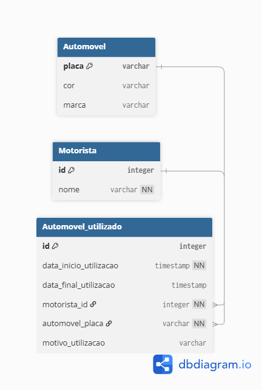

# Teste Técnico - SEIDOR 

Qualquer duvida me contate por email responderei o mais rápido o possivel rafasc866@gmail.com

## Sobre

Esse repositório é um teste técnico de uma WebAPI para controlar automóvel e motoristas que utilizam essa rede de automóveis.

## Rodando o projeto

Este projeto pode ser rodado com docker ou sem docker (recomendo fortemente utilizar o docker por ser mais rapido e não ter que depender do versionamento do node da sua maquina)

## Docker vs Localmente

docker build -t minha-api .

docker run -p 3000:3000 -p 9229:9229 minha-api

## Endpoints da API


### Automóvel

| Método | Path | Descrição |
| :--- | :--- | :--- |
| **GET** | `/automovel/listarPorFiltro` | Retorna uma lista de todos os automóveis filtrados. requer um objeto de filtro `AutomovelFiltroDTO`. |
| **GET** | `/automovel/buscarPorPlaca/{placa}` | Retorna os detalhes de um automóvel específico. |
| **POST** | `/automovel/criar` | Cria um novo automóvel. Requer um objeto `Automovel` no body. |
| **PUT** | `/automovel/atualizar/{placa}` | Atualiza todas as informações de um automóvel existente. Requer um objeto `AutomovelAtualizarDTO` no body |
| **DELETE** | `/automovel/deletar/{placa}` | Remove um automóvel. |

#### Exemplo de Uso (Criar Automóvel)

```bash
curl -X POST /automovel/criar \
     -H "Content-Type: application/json" \
     -d '{"marca": "Toyota", "cor": "azul"}'
```

### Motorista

| Método | Path | Descrição |
| :--- | :--- | :--- |
| **GET** | `/motorista/listarPorFiltro` | Retorna uma lista de todos os motoristas filtrados. requer um objeto de filtro `MotoristaFiltroDTO`. |
| **GET** | `/motorista/buscarPorId/{id}` | Retorna os detalhes de um motorista específico. |
| **POST** | `/motorista/criar` | Cria um novo motorista. Requer um objeto `Motorista` no body. |
| **PUT** | `/motorista/atualizar/{id}` | Atualiza todas as informações de um motorista existente. Requer um objeto `MotoristaAtualizarDTO` no body |
| **DELETE** | `/motorista/deletar/{id}` | Remove um motorista. |

#### Exemplo de Uso (Criar Automóvel)

```bash
curl -X POST /motorista/criar \
     -H "Content-Type: application/json" \
     -d '{ nome: "rafael" }'
```

### Automovel Utilizado

| Método | Path | Descrição |
| :--- | :--- | :--- |
| **POST** | `/automovelUtilizado/criar` | Cria um automovel utilizado por um motorista requer seguir a regra de nogico e um objeto `AutomovelUtilizadoCriarDTO`. |
| **PATCH** | `/automovelUtilizado/finalizarUtilizacao/{motoristaId}` | Finaliza a utilizacao de um automovel. |
| **GET** | `/automovelUtilizado/listar` | Lista todos os automoveis utilizados |

#### Exemplo de Uso (Criar Automóvel)

```bash
curl -X POST /automovelUtilizado/criar \
     -H "Content-Type: application/json" \
     -d '{ "id": null,
        "dataInicioUtilizacao": "08/12/2025",
        "dataFinalUtilizacao": null,
        "motoristaId": 1,
        "automovelPlaca": "DEFEFZzE",
        "motivoDaUtilizacao": "Seguir carreira como motorista de uber"
    }'
```

## Modelagem de dados

Esta foi a modelagem de dados feita de acordo com as exigências do teste técnico.



## Técnologias e linguagem utilizadas:
    As técnologias utilizadas foram:
- TypeScript
- NodeJS (ExpressJS)
- Git
- Docker